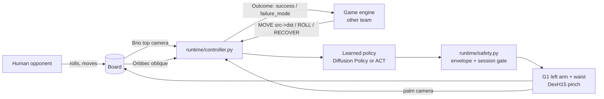
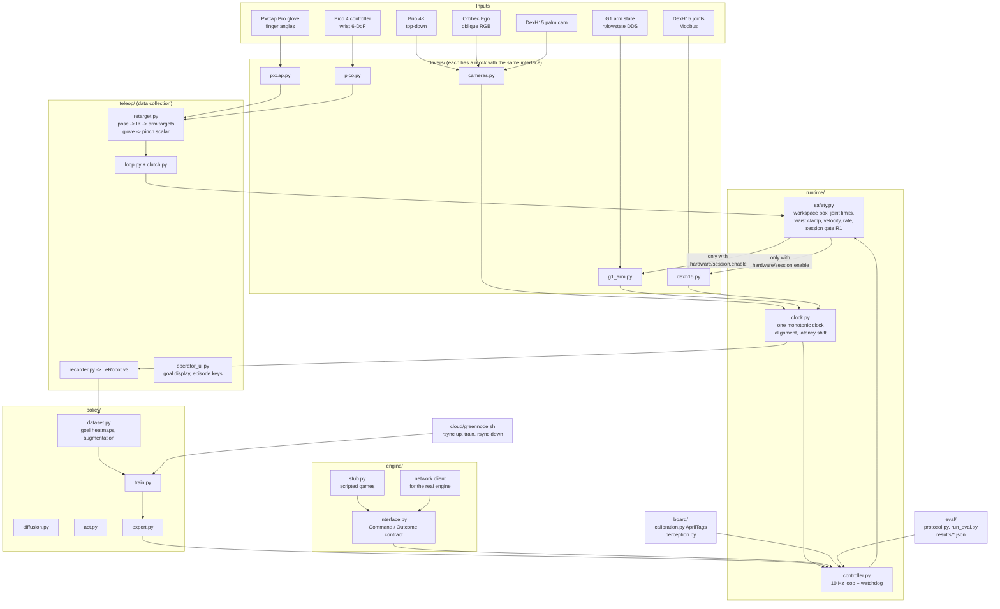
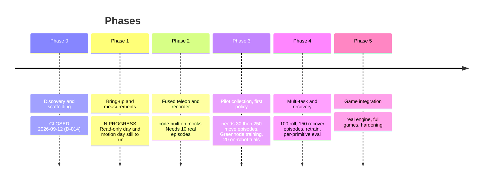

# LUDO-G1 handover

Written 2026-09-14 by Fable (the reviewing agent) for the engineer taking over from Alois.
Read this first, then `CLAUDE.md` (the rules), then `agents/STATE.md` (where things stand today).
Repo: `github.com/HashBrake/ludo-g1` (private). Local checkout on the lab laptop: `~/Desktop/ludo-g1`.

---

## 1. What we are building

A Unitree G1 humanoid, mounted on a rig by the hip, plays a full game of Ludo (Vietnamese cờ cá ngựa)
against humans with its **left arm** and a **Paxini DexH15 hand**. Every motion the robot makes comes
from a **learned policy trained on teleoperation data** collected on this exact robot. There is no
scripted motion in the deployed system. A separate **game engine** (another team) decides the move;
the policy executes it.



**Definition of done.** The robot completes a full game, executing every one of its own turns
(roll die, move horse, capture, enter from base) with more than 90 % success per primitive and
automatic recovery from the listed failure cases, with a human present and an e-stop within reach
but never used. Measured over at least three complete games.

### The three primitives

| Primitive | What the arm does | Goal conditioning |
|---|---|---|
| `MOVE` | pick a horse at a source cell, place it at a target cell (also covers enter-from-base and capture) | two heatmap channels drawn on the top camera image: source cell, target cell |
| `ROLL` | pick the die from its bowl, release it above the bowl | heatmap on the bowl |
| `RECOVER` | re-stand or re-seat a horse that fell or landed between cells | heatmap on the fallen horse |

### Observation and action

- **Observation:** `top` (Brio, 640x480 board crop), `oblique` (Orbbec, 640x480), `palm` (DexH15 camera,
  320x240), `state` (7 arm joints + waist yaw + pinch scalar), goal heatmaps, task one-hot.
- **Action:** 7 arm joint targets + waist yaw + **one pinch scalar in [0, 1]**, absolute, 30 Hz, in
  chunks of 16 from a 10 Hz policy.
- **The pinch scalar** maps through a fixed synergy to the 15 DexH15 joints. During teleop the glove's
  thumb-index distance drives the same scalar, so operator and policy live in one action space.

---

## 2. The system, end to end



**Every motion command passes through `runtime/safety.py`.** It refuses everything unless the file
`hardware/session.enable` exists, is unexpired, and was written by a human through
`tools/hardware_checks/enable_session.py`. The agents never touch that file. That is rule R1, and it is
enforced in code, not by trust.

### Repo map

```
ludo-g1/
  CLAUDE.md               the rules and the plan (single source of truth)
  agents/                 how the AI agents and humans talk (section 5 below)
  config/                 robot, cameras, hand, board, safety, training (yaml; UNMEASURED = placeholder)
  drivers/                one thin wrapper per device + drivers/mock/
  runtime/                clock, safety, controller, config loader
  teleop/                 retargeting, IK, clutch, loop, recorder, operator UI
  board/                  AprilTag calibration, perception
  engine/                 contract, stub, network client
  policy/                 dataset, diffusion, act, train, export
  eval/                   protocol, runner, results/
  cloud/                  greennode.sh
  tools/hardware_checks/  bring-up scripts: the ONLY place scripted motion is allowed
  tests/                  pytest, 902 tests; markers readonly and motion
  docs/                   one page per module + runbook_phase1.md + sdks.md
  third_party/            vendored SDKs, never modified in place
  data/                   datasets, checkpoints, logs (git-ignored)
```

---

## 3. What has been built

Forty-three tasks accepted (T-001 to T-047, minus the four motion tasks). About 18 000 lines of
code, 13 800 lines of tests, 4 700 lines of docs. All of it verified on mock drivers; two things
verified on real hardware (the Orbbec camera and the SDK inventory).

```mermaid
flowchart LR
    classDef done fill:#2e7d32,color:#fff,stroke:none
    classDef real fill:#1565c0,color:#fff,stroke:none
    classDef todo fill:#b71c1c,color:#fff,stroke:none

    subgraph "Phase 0: scaffolding (closed)"
        p01[repo, venv, pre-commit CI]:::done
        p02[SDK inventory docs/sdks.md]:::real
        p03[configs + validated loader]:::done
        p04[clock.py]:::done
        p05[safety.py + session gate]:::done
        p06[mock drivers]:::done
        p07[engine contract + stub]:::done
        p08[board calibration]:::done
        p09[greennode.sh]:::done
    end
    subgraph "Phase 1: bring-up (in progress)"
        p10[camera driver]:::real
        p11[arm FK + 8-DoF IK]:::done
        p12[arm state reader]:::done
        p13[DexH15 reader + palm cam]:::done
        p14[glove + Pico readers]:::done
        p15[Orbbec 10-min stats,<br/>kernel timestamps]:::real
        p16[pre-flight go/no-go]:::done
        p17[runbook_phase1.md]:::done
        p18[T-021 arm write path<br/>+ latency]:::todo
        p19[T-022 hand write path<br/>+ pinch synergy]:::todo
        p20[T-023 reachable cells]:::todo
        p21[T-024 envelope test]:::todo
    end
    subgraph "Phase 2 to 5: built ahead, on mocks"
        p22[teleop loop + clutch]:::done
        p23[recorder LeRobot v3]:::done
        p24[operator UI]:::done
        p25[dataset viewer]:::done
        p26[dataset loader + heatmaps]:::done
        p27[Diffusion Policy wrapper]:::done
        p28[ACT wrapper]:::done
        p29[train.py: checkpoints,<br/>resume, disk guard]:::done
        p30[export bundle]:::done
        p31[eval protocol + runner]:::done
        p32[controller watchdog +<br/>failure logging]:::done
        p33[episode-end head]:::done
        p34[network engine client]:::done
        p35[board perception<br/>synthetic]:::done
    end
```



Green: built and accepted on mocks. Blue: also measured on real hardware. Red: waiting for a human
session.

### Numbers that shaped decisions (all reproducible; the command sits next to each in `agents/BUILD_LOG.md`)

| What | Value | Consequence |
|---|---|---|
| Full Diffusion Policy inference on the laptop CPU | 804 ms median (DDIM 10) | 8x over the 100 ms budget; D-019 |
| ACT on the laptop, 8 threads | 91 ms | fits; D-021 |
| `diffusion_small` (shared encoder, 120x160) | 80 ms (DDIM 10), 53 ms (DDIM 5) | fits; D-021. Which model deploys is decided by on-robot eval, not by speed |
| Arm IK, warm | 0.6 ms mean, 9 ms p99 | teleop loop runs well inside 30 Hz |
| Orbbec Ego | 1600x1200 @ 30 MJPG only mode; 600 s: 0 frames lost, kernel-stamp jitter p99 0.81 ms | camera frames carry the kernel capture stamp; D-025, D-026 |
| Mock recorder skew | p99 6.7 ms | inside the 10 ms budget |
| Disk on /home | 12 GB free | real recording needs an external SSD; Q-002 |

### Decisions you should know exist (details in `agents/DECISIONS.md`)

- **D-006** we solve our own arm IK (MuJoCo + mink); the vendored Teleopit stack is reference only.
- **D-009** the Orbbec is RGB only; depth is deferred.
- **D-015** dataset format is LeRobot v3.
- **D-018** no teleop engage without a clutch; the first command after engage is step-capped.
- **D-022** envelope values for the first motion session are human-approved placeholders. A human commits them.
- **D-025** camera frames use the V4L2 kernel timestamp; the Ego's by-id link is ambiguous, so by-path is used.

---

## 4. Where we are now, and what happens next



**Right now the agent loop is stopped** (rule R4(b)): every remaining task needs a human on the
physical hardware. No motion command has ever been sent to the robot. The next thing that happens is
**your first hardware day**, and `docs/runbook_phase1.md` is the whole procedure. In short:

```mermaid
flowchart TD
    A[Day 1: read-only, no session] --> A1[H-002 robot LAN up, ping 192.168.123.164]
    A --> A2[H-003 plug in Brio + DexH15, motors off]
    A --> A3[H-004 glove + Pico; stop holosim-pcservice on port 63901]
    A1 & A2 & A3 --> A4[fill device keys in config/*.yaml]
    A4 --> A5[10-minute stream stats per device<br/>stream_stats.py --backend real --seconds 600]
    A5 --> B[Day 2: calibration, no session]
    B --> B1[H-001 two Brio stills of the board]
    B1 --> B2[board.calibration -> config/board_calib.yaml]
    B2 --> C[Day 3: first motion session]
    C --> C0[Q-004: name the physical e-stop<br/>approve envelope values, HUMAN commit]
    C0 --> C1[session_preflight.py says GO]
    C1 --> C2[enable_session.py  (human only)]
    C2 --> C3[T-021 arm latency]
    C3 --> C4[T-024 envelope boundary test]
    C4 --> C5[T-022 pinch synergy, 10 grasps each]
    C5 --> C6[T-023 reachable cells]
```

Before day 3 also settle **Q-001** (Greennode SSH credentials in `~/.config/ludo-g1/env`) and
**Q-002** (an SSD for `data/`). Neither blocks the motion day but both block Phase 2 recording.

---

## 5. How to work with the AI agents

This project is run by **two Claude Code agents in one terminal session**, and the human steers
them through files, not chat. This is the part most worth understanding.

```mermaid
sequenceDiagram
    participant H as You (human)
    participant F as Fable (decider, reviewer)
    participant O as Opus (builder, spawned per task)
    participant R as Repo + GitHub

    H->>R: edit agents/*.md, add HUMAN: lines, do hardware steps
    H->>F: type "continue" in the Claude Code terminal
    F->>R: read STATE.md, HARDWARE_NEEDED.md, QUESTIONS.md, DECISIONS.md
    F->>R: pick next task, set in_progress, commit
    F->>O: spawn with the task block from TASKS.md
    O->>R: build, write tests, run acceptance checks, BUILD_LOG.md, commit [opus][T-nnn]
    O-->>F: 30-line report
    F->>R: read the whole diff, re-run every check, REVIEW.md accept/return
    F->>R: DECISIONS.md, TASKS.md, STATE.md, commit [fable], push
    F-->>H: summary in the terminal; stops only when all work needs you
```

### Roles

- **Fable** (the model you talk to): owns architecture, task definitions, acceptance criteria, review,
  decisions, audits. Reads every diff Opus produces. Does not write production code except logged
  one-line fixes.
- **Opus** (spawned by Fable per task): builds, tests, measures, documents, commits. Never changes scope.
- **You**: the only one who may enable a session, change safety values, spend money, and operate the
  robot. You are also the reviewer of last resort: read `REVIEW.md` and `DECISIONS.md`.

### The files are the interface

| File | Who writes | What you do with it |
|---|---|---|
| `agents/STATE.md` | Fable | **Read this first every time.** Phase, last accepted commit, next three tasks, what you must do |
| `agents/HARDWARE_NEEDED.md` | agents | Numbered H-items with exact commands and the check the agent runs afterwards. Do them, then say `continue` |
| `agents/QUESTIONS.md` | agents | Q-items with the assumption the agents proceed on. Answer inline with a line starting `HUMAN:` |
| `agents/DECISIONS.md` | Fable | Append-only log of every decision with rationale. To overrule one, append `HUMAN: ...` under it |
| `agents/TASKS.md` | Fable (Opus updates status only) | The queue. You may add a task in the same format or ask Fable to |
| `agents/REVIEW.md` | Fable | Verdict per task with numbered findings. Read to judge quality |
| `agents/BUILD_LOG.md` | Opus | Everything built, every command run, every number measured |
| `agents/BLOCKERS.md` | either | Hard blockers. An open one halts the loop. You mark it RESOLVED |

A `HUMAN:` line anywhere in these files overrides anything an agent wrote.

### Starting a session

```bash
cd ~/Desktop/ludo-g1
claude          # Fable 5.1 model, permissions skipped (the safety gate is in code, not in the permission mode)
```

Then type `continue`. Fable resumes from `agents/STATE.md`, checks for `HUMAN:` lines and completed
H-items, and runs the loop. If you start from a fresh machine, the prompt is:

> You are Fable for LUDO-G1. Read CLAUDE.md fully. agents/ exists: resume from agents/STATE.md and
> run the loop of CLAUDE.md section 4.5 without idling. Spawn Opus subagents for every build task.
> Never create hardware/session.enable. Stop only under R4.

### Working side by side, not question by question

The loop is designed to run for hours without you. The most productive pattern is:

1. **Give it a hardware day, not a question.** Do the H-items on the physical robot in the order the
   runbook gives, then `continue`. Fable runs the post-checks, folds the numbers into the configs and
   docs, and queues the next tasks itself. You do not need to explain what you did; the checks see it.
2. **Steer through files, in writing.** A `HUMAN:` line in `DECISIONS.md` is worth more than an hour of
   chat: it survives restarts, Opus sees it, and it is in git. Chat messages are not.
3. **Read reviews, not code, unless you want to.** `REVIEW.md` says what was verified and how. If a
   verdict looks weak, say so in `DECISIONS.md` with `HUMAN:` and Fable re-reviews.
4. **Let it be honest.** Rule R5 means no success claim without a logged measurement. When an acceptance
   criterion fails, the agents report it as measured (T-046 did) rather than re-running for a clean
   number. Do not ask for a passing number; ask what the number means.
5. **Keep the laptop quiet during measurements.** Stream statistics and latency measurements are host
   sensitive. Do not run a test suite or a training job in parallel with a 600 s stream.
6. **On a hardware day, sit with it.** For the motion tasks (T-021 to T-024), you hold the e-stop, you
   enable the session, and Fable narrates in `BUILD_LOG.md` what will move and the envelope in force
   before every run. The `!` prefix in the Claude Code prompt runs a shell command yourself so its
   output lands in the conversation (for example `! nmcli con up robot-lan`).
7. **Ask for new work in task form.** "Add a task: X, acceptance: Y" is what Fable can act on. It will
   write the task block, prioritize it, and spawn Opus.
8. **Abort order** if anything goes wrong on the robot: e-stop, Ctrl-C, delete
   `hardware/session.enable`, then write one line `SAFETY INCIDENT: ...` in `agents/BLOCKERS.md`.
   The loop stops under R4(c) until a human clears it.

### What the agents will not do, by design

- Create, edit or restore `hardware/session.enable`.
- Loosen `config/safety.yaml` (they may propose in `DECISIONS.md`; you commit).
- Modify anything under `third_party/` (patches live in `patches/`, applied at setup).
- Claim a success rate without an `eval/results/*.json` file behind it.
- Put scripted motion anywhere outside `tools/hardware_checks/`.

### Ten-second daily routine

```
git pull
cat agents/STATE.md            # where are we, what does it need from me
cat agents/HARDWARE_NEEDED.md  # do the open H-items
cat agents/QUESTIONS.md        # answer with HUMAN: lines
claude  ->  continue           # let it run
```

---

## 6. Practical facts

- Python is exactly 3.10 (`uv venv --python 3.10 && uv pip install -r requirements.txt`). The DexH15
  SDK ships a cp310-only wheel.
- Pre-commit hook runs ruff and the full suite (about 8 to 10 minutes) on every commit. Do not bypass it.
- Tests: `.venv/bin/python -m pytest -q`. Marker `readonly` needs devices attached and skips otherwise;
  marker `motion` needs a valid session and skips otherwise.
- Every config placeholder is the literal `UNMEASURED` or a `<key>_status: UNMEASURED` sibling.
  `tools/hardware_checks/session_preflight.py` lists exactly what still blocks a motion session.
- Robot LAN: laptop 192.168.123.2, G1 192.168.123.164, DDS over wired Ethernet.
- Training runs on Greennode, never on the laptop (12 GB free, weak GPU). Laptop does collection,
  tests, inference.
- Vendor SDKs in `third_party/` are the vendors' property. Keep the GitHub repo private.
